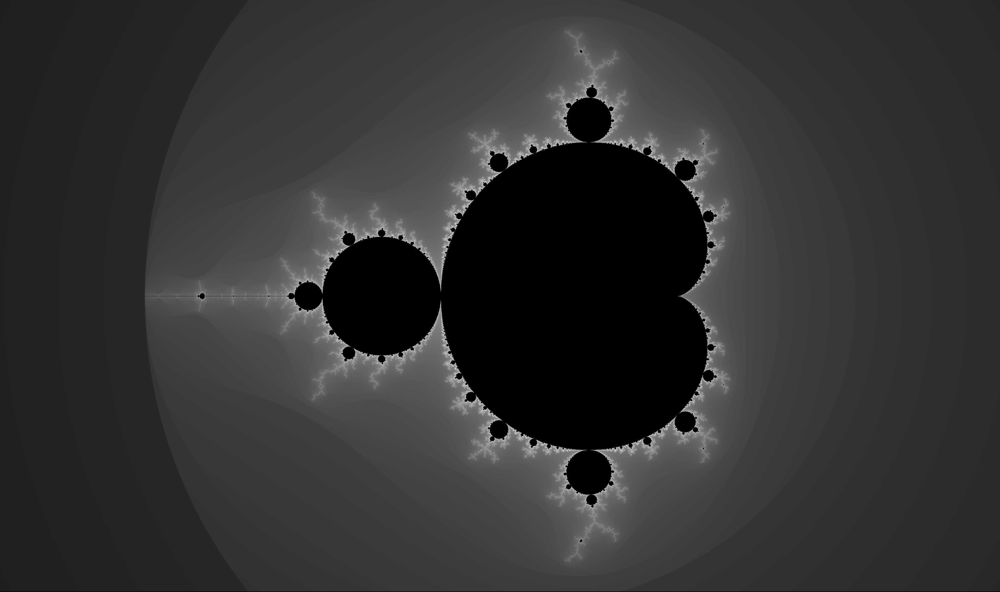
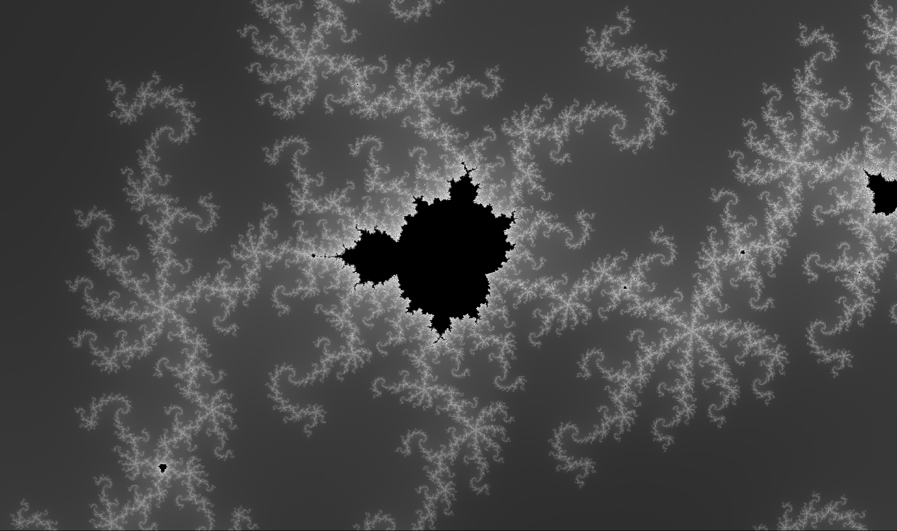

# Mango

A visualiser of **Man**delbrot set written in **Go**





## Installation & usage

`go install github.com/drahoslove/mango@latest`

```cd `go env GOPATH`/bin```

`./mango[.exe] [image.png]`


## Kye binding

### navigation

- `pgDn` / `pgUp` or `wheel ↕` - zoom in / zoom out
- `←` `→` `↑` `↓` - move left/right/up/down
- `R` - reset zoom and position


### visual
- `1` `2` `3` `4` - switch between coloring modes
- `H` - set number of steps to High (32k)
- `J` - double the number of steps
- `K` - halve the number of steps
- `L` - set number of steps to Low (1k)

### images
- `ctrl`+`S` - save current image
- `ctrl`+`O` - load saved image
